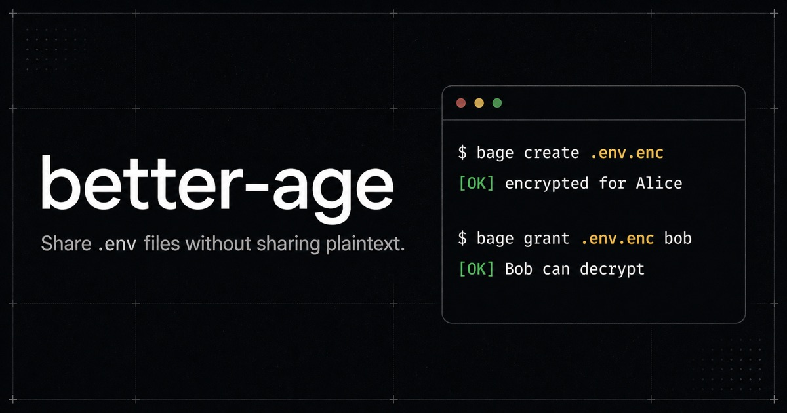

# better-age

<p align="center">
  <a href="https://bage.paulsenon.com/docs">
    
  </a>
</p>

<p align="center">
  <a href="https://www.npmjs.com/package/@better-age/cli"></a>
  <a href="https://www.npmjs.com/package/@better-age/varlock"></a>
  <a href="LICENSE"></a>
  <a href="https://bage.paulsenon.com/docs"></a>
</p>

**better-age** is a simple cli for local-first workflow for encrypted `.env` files sharing. 

It keeps the team habit simple: one env file, few teammate, one local command.
The file you pass around is age-encrypted ciphertext, and access changes are
explicit payload rewrites.

## Quickstart

Install the CLI globally:

```sh
npm install -g @better-age/cli
```

Create and edit one encrypted payload:

```sh
bage setup --name Alice
bage create .env.enc
bage edit .env.enc
bage view .env.enc
```

Share with Bob:

```sh
bage identity import 'better-age://identity/v1/...' --alias bob
bage grant .env.enc bob
```

Load for machines:

```sh
bage load .env.enc --protocol-version=1
```

Or use the [varlock](https://varlock.dev/) plugin:

```txt
# .env.schema

# @plugin(@better-age/varlock)
# @initBetterAge(path=.env.enc)
# @setValuesBulk(betterAgeLoad(), format=env)
```

```sh
varlock run -- npm run dev
```

Full docs:

- [Install](https://bage.paulsenon.com/docs/install)
- [Quickstart](https://bage.paulsenon.com/docs/quickstart)
- [Share with a teammate](https://bage.paulsenon.com/docs/guides/share-with-teammate)
- [CLI reference](https://bage.paulsenon.com/docs/reference/cli)
- [Varlock plugin reference](https://bage.paulsenon.com/docs/reference/varlock-plugin)

## What It Is

- `age` is the cryptographic primitive.
- `better-age` is the local UX layer around env payloads, identities, grants,
  revokes, and machine loading.
- Payloads are visible caller-owned files, not hidden cloud state.
- Humans use `bage view`; machines use `bage load --protocol-version=1`.
- Scope stays narrow: env-file workflow, not general-purpose secret management.

## Packages

| Path | Package | Job |
| --- | --- | --- |
| [packages/cli](packages/cli/README.md) | `@better-age/cli` | Release-facing `bage` CLI. Owns terminal UX, command flows, prompts, editor/viewer adapters, and stdout/stderr policy. |
| [packages/core](packages/core/README.md) | `@better-age/core` | Internal core library for artifact codecs, identity lifecycle, payload lifecycle, migrations, crypto ports, and typed outcomes. |
| [packages/varlock](packages/varlock/README.md) | `@better-age/varlock` | Thin Varlock plugin. Shells out to `bage load --protocol-version=1 <path>` and preserves the stdio contract. |
| `packages/cli-legacy` | private | Old proof-of-concept reference. Not a release target. |

## Monorepo Map

- [apps/website](apps/website/README.md): docs website source for
  <https://bage.paulsenon.com/docs>
- [infra/website](infra/website/README.md): Alchemy/Cloudflare deployment for
  the docs website
- [docs](docs): release operations, manual QA, ADRs, and maintenance docs
- [VISION.md](VISION.md): product bet and tradeoffs
- [UBIQUITOUS_LANGUAGE.md](UBIQUITOUS_LANGUAGE.md): canonical project terms
- [CONTRIBUTING.md](CONTRIBUTING.md): repo rules, reading order, and checks
- [LICENSE](LICENSE): project license
- [THIRD_PARTY_NOTICES.md](THIRD_PARTY_NOTICES.md): dependency notices

## Repo Setup

Requirements:

- Node.js
- pnpm

Install workspace dependencies:

```sh
pnpm install
```

Useful checks:

```sh
pnpm check
pnpm test
```

Per package:

```sh
pnpm -F @better-age/cli check
pnpm -F @better-age/core test
pnpm -F @better-age/varlock check
```

## Contributing Index

Start here:

- [CONTRIBUTING.md](CONTRIBUTING.md): repo contribution guide
- [.github/PULL_REQUEST_TEMPLATE.md](.github/PULL_REQUEST_TEMPLATE.md): PR checklist
- [docs/manual-qa.md](docs/manual-qa.md): manual behavior checklist
- [docs/release-operations.md](docs/release-operations.md): release flow
- [docs/contributor-schema-breaking-changes.md](docs/contributor-schema-breaking-changes.md): schema migration notes
- [docs/adr](docs/adr): architecture decisions

Docs split:

- root README: project pitch, quickstart, package index, contribution index
- package README: package contract, install/build shape, package-specific usage
- website docs: user-facing tutorials and reference
